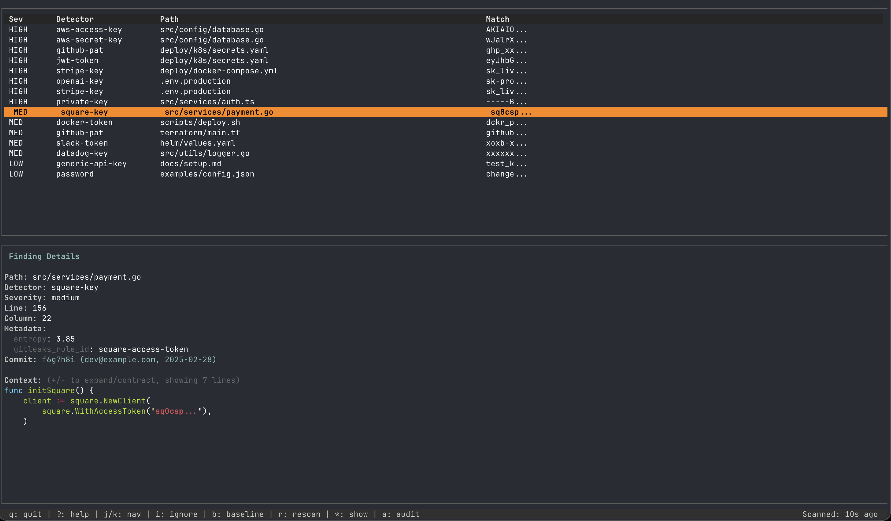

# Redactyl

[](LICENSE)
[](https://github.com/varalys/redactyl/actions/workflows/test.yml)
[](https://github.com/varalys/redactyl/actions/workflows/lint.yml)
[](https://github.com/varalys/redactyl/actions/workflows/vuln.yml)
[](https://github.com/varalys/redactyl/actions/workflows/release.yml)

**Deep artifact scanner for cloud-native environments** - Find secrets hiding in container images, Helm charts, Kubernetes manifests, and nested archives without extracting to disk.

Powered by [Gitleaks](https://github.com/gitleaks/gitleaks) for detection, enhanced with intelligent artifact streaming and context-aware analysis.



## Why Redactyl?

Secrets don't just live in Git history, they hide in **container images, Helm charts, CI/CD artifacts, and nested archives**.  Redactyl finds secrets in complex cloud-native artifacts without extracting them to disk.

**Key differentiators:**
- **Deep artifact scanning** - Stream archives, containers, Helm charts, and K8s manifests without disk extraction
- **Virtual paths** - Track secrets through nested artifacts: `chart.tgz::templates/secret.yaml::line-123`
- **Powered by Gitleaks** - Uses Gitleaks' detection engine; we focus on artifact intelligence
- **Privacy-first** - Zero telemetry; self-hosted
- **Complete remediation** - Forward fixes and history rewriting with safety guardrails

## Installation

```sh
# Homebrew (macOS/Linux)
brew install varalys/tap/redactyl

# Go install
go install github.com/varalys/redactyl@latest

# Build from source
make build && ./bin/redactyl --help
```

## Quick Start

```sh
redactyl scan                    # Interactive TUI (default)
redactyl scan --no-tui           # Non-interactive for CI/CD
redactyl scan --json             # JSON output
redactyl scan --sarif            # SARIF output for GitHub Code Scanning
redactyl scan --guide            # Include remediation suggestions
```

**Scope control:**

```sh
redactyl scan --staged           # Staged changes only
redactyl scan --history 5        # Last N commits
redactyl scan --base main        # Diff vs base branch
```

## Deep Scanning

Scan cloud-native artifacts with configurable guardrails:

```sh
redactyl scan --archives         # zip, tar, tgz (nested supported)
redactyl scan --containers       # Docker tarballs, OCI format
redactyl scan --helm             # Helm charts (.tgz and directories)
redactyl scan --k8s              # Kubernetes manifests
redactyl scan --registry alpine  # Remote OCI images (no pull required)
```

**With guardrails:**

```sh
redactyl scan --archives --containers --helm --k8s \
  --max-archive-bytes 67108864 \
  --max-depth 3 \
  --scan-time-budget 10s
```

See [docs/deep-scanning.md](docs/deep-scanning.md) for details.

## Configuration

Redactyl reads configuration in order of precedence:
1. CLI flags
2. `.redactyl.yml` at repo root
3. `~/.config/redactyl/config.yml`

```sh
redactyl config init                      # Generate starter config
redactyl config init --preset minimal     # Critical detectors only
```

See [.redactyl.example.yaml](.redactyl.example.yaml) for all options.

## Interactive TUI

The TUI opens by default and provides real-time findings with severity color-coding, vim-style navigation, syntax-highlighted context preview, and quick actions for baseline, ignore, and export.

Press `?` in the TUI for all keyboard shortcuts.

```sh
redactyl scan              # Opens TUI
redactyl scan --view-last  # View last scan without rescanning
redactyl scan --no-tui     # Disable for scripts/CI
```

The TUI auto-disables when output is piped or `--json`/`--sarif` is used.

## Baseline & Ignore

```sh
redactyl baseline update   # Suppress current findings in future scans
```

Create `.redactylignore` at repo root (gitignore syntax) to skip paths:

```
node_modules/
dist/
testdata/**
```

## Filtering Results

Filter by Gitleaks rule IDs:

```sh
redactyl scan --enable "github-pat,aws-access-key"
redactyl scan --disable "generic-api-key"
redactyl detectors         # List common rule IDs
```

For custom detection rules, use a `.gitleaks.toml` file. See [Gitleaks configuration](https://github.com/gitleaks/gitleaks#configuration).

## Remediation

**Forward-only fixes:**

```sh
redactyl fix path .env --add-ignore                    # Remove and ignore file
redactyl fix dotenv --from .env --to .env.example      # Generate example file
```

**History rewrite (dangerous; requires force-push):**

```sh
redactyl purge path secrets.json --yes                 # Remove from all history
redactyl purge pattern --glob '**/*.pem' --yes         # Remove by pattern
```

Add `--dry-run` to preview commands without executing.

## Output & Exit Codes

| Exit | Meaning |
|------|---------|
| 0 | No findings (or below `--fail-on` threshold) |
| 1 | Findings at or above threshold |
| 2 | Scan error |

JSON and SARIF schemas are documented in [docs/schemas/](docs/schemas/).

## CI/CD Integration

```yaml
# GitHub Actions
- run: redactyl scan --sarif > redactyl.sarif.json
- uses: github/codeql-action/upload-sarif@v3
  with:
    sarif_file: redactyl.sarif.json
```

```sh
# Pre-commit hook
redactyl hook install --pre-commit

# Generate CI templates
redactyl ci init --provider gitlab  # or bitbucket, azure
```

## Audit Logging

Redactyl maintains an append-only audit log at `.git/redactyl_audit.jsonl` for compliance tracking. Logs are redacted by default.

See [docs/audit-logging.md](docs/audit-logging.md) for format and usage.

## Privacy

No telemetry by default. Optional `--upload` can omit metadata with `--no-upload-metadata`.

## Public Go API

```go
import "github.com/varalys/redactyl/pkg/core"

cfg := core.Config{...}
findings, err := core.Scan(cfg)
```

## Updates

```sh
redactyl update  # Update from GitHub Releases
```

See [CHANGELOG.md](CHANGELOG.md) for release notes.

## Acknowledgments

Built with [Gitleaks](https://github.com/gitleaks/gitleaks), [Bubbletea](https://github.com/charmbracelet/bubbletea), [go-containerregistry](https://github.com/google/go-containerregistry), [go-git](https://github.com/go-git/go-git), and [Chroma](https://github.com/alecthomas/chroma).

## License

Apache-2.0. See [LICENSE](LICENSE).

## Contributing

See [CONTRIBUTING.md](CONTRIBUTING.md). To add detection rules, contribute to [Gitleaks](https://github.com/gitleaks/gitleaks) or create custom rules in `.gitleaks.toml`.
